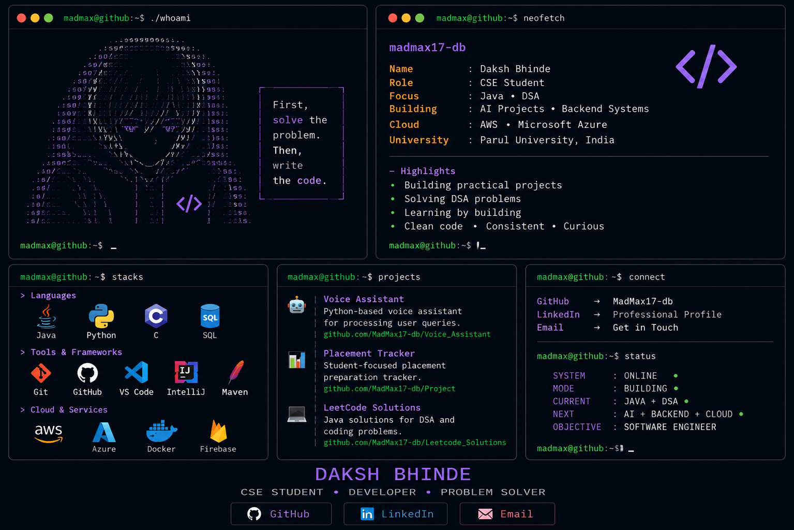

<div align="center">




</div>

<div align="center">

## `~/connect`

```text
madmax@github:~$ connect

GitHub    →  MadMax17-db
LinkedIn  →  Professional Profile
Email     →  Get in Touch
```

[**GitHub**](https://github.com/MadMax17-db) &nbsp; • &nbsp;
[**LinkedIn**](https://www.linkedin.com/in/daksh-bhinde-99abb7360/) &nbsp; • &nbsp;
[**Email**](mailto:dakshthacker07@gmail.com)

<br><br>

> `CODE → BUILD → DEBUG → LEARN → REPEAT`
